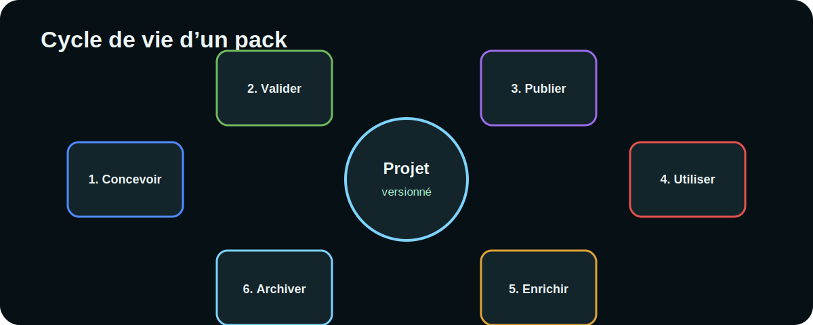

# Cycle de vie et publication d’un pack



## 1. Concevoir

Définir le but, les publics, le vocabulaire, les types et les relations. Créer
un petit échantillon avant de produire l’ensemble du corpus.

## 2. Valider

Contrôler :

- unicité des identifiants ;
- conformité des types ;
- présence des champs obligatoires ;
- existence des cibles de relations ;
- lisibilité des tableaux et images ;
- cohérence du manifeste.

## 3. Publier

Mettre à jour :

```json
{
  "version": "1.2.0",
  "date_generation": "2026-06-11"
}
```

Exporter le pack, le réimporter dans une session vierge, puis diffuser l’archive
validée.

## 4. Utiliser

Pendant les ateliers, éviter de modifier simultanément le schéma et le contenu.
Collecter les demandes d’évolution dans une liste séparée.

## 5. Enrichir

Intégrer les fiches nouvelles, corriger les liens, consolider les commentaires
et documenter les décisions.

## 6. Archiver

Conserver :

- le ZIP publié ;
- une copie décompressée ;
- le journal des changements ;
- la version de l’application utilisée ;
- les éventuelles contributions exportées.

## Versionnement conseillé

| Changement | Version |
|---|---|
| correction de texte ou lien | correctif `1.0.1` |
| ajout compatible de fiches ou champs | mineure `1.1.0` |
| rupture de schéma ou migration | majeure `2.0.0` |

## Critères de sortie

- [ ] Le pack s’importe sans erreur.
- [ ] Le nombre de fiches correspond au manifeste.
- [ ] Aucun type n’est absent du schéma.
- [ ] Les images locales s’affichent.
- [ ] Les exports conservent l’arborescence.
- [ ] Une archive précédente permet le retour arrière.
