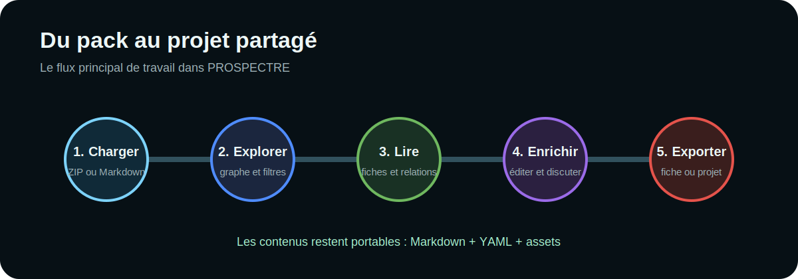

# Bienvenue dans PROSPECTRE

PROSPECTRE est une application web de **cartographie, exploration et
documentation de systèmes complexes**. Elle transforme un ensemble de fichiers
Markdown reliés par des métadonnées YAML en graphe interactif.

## Ce que l’outil permet

- explorer visuellement un projet et ses relations ;
- filtrer, rechercher et suivre un chemin dans le graphe ;
- lire et modifier localement des fiches Markdown ;
- commenter et collaborer lorsque Firebase est activé ;
- importer ou exporter une fiche, un pack ou un schéma ;
- administrer les types, les libellés, les champs et les dossiers ;
- utiliser Markdown pour produire des fiches riches et portables.

> **Principe central :** le contenu reste dans des fichiers ouverts et
> transportables. L’application fournit une couche d’exploration et de
> collaboration sans enfermer le projet dans une base propriétaire.

## Choisir son parcours

| Je veux… | Commencer par |
|---|---|
| découvrir l’interface | [Premiers pas](entity:guide:premiers-pas) |
| comprendre le graphe | [Explorer le graphe](entity:guide:explorer-graphe) |
| modifier une fiche | [Lire et modifier les fiches](entity:guide:fiches-edition) |
| travailler à plusieurs | [Collaboration et activité](entity:guide:collaboration) |
| administrer les types et champs | [Administrer le modèle](entity:procedure:administrer-modele) |
| créer un pack compatible | [Format d’un pack](entity:architecture:format-pack) |
| déployer l’application | [Déploiement](entity:architecture:deploiement) |
| maîtriser le rendu enrichi | [Cheat sheet Markdown](entity:reference:markdown) |
| connaître le périmètre stabilisé | [PROSPECTRE 1.0](entity:guide:nouveautes-v1) |
| migrer un ancien corpus | [Migrer un pack vers la v1](entity:procedure:migrer-pack-v1) |

## Vocabulaire essentiel

**Pack**
: dossier ou archive ZIP contenant un manifeste, des Markdown et
éventuellement des images.

**Type**
: catégorie de fiche visible dans les filtres et dans le graphe.

**Front matter**
: bloc YAML placé en tête d’un Markdown. Il porte l’identifiant, le type, le
titre et les relations.

**Schéma**
: définition administrable des types, champs, couleurs, dossiers et valeurs
autorisées.

**Relation**
: lien déclaré entre deux identifiants et visualisé dans le graphe.

## Démarrage rapide

1. Ouvrir le menu **Importer / exporter**.
2. Importer un ZIP ou plusieurs Markdown.
3. Utiliser les filtres de type et la recherche.
4. Sélectionner un nœud pour ouvrir sa fiche.
5. Exporter le projet afin de conserver les modifications et contributions.

La suite recommandée est [Premiers pas](entity:guide:premiers-pas).
