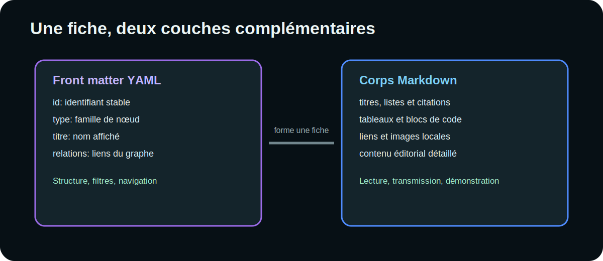

# Cheat sheet Markdown



## Titres

```markdown
# Titre principal
## Section
### Sous-section
```

Conserver un seul titre principal et éviter de sauter directement de `##` à
`####`.

## Emphase

```markdown
**gras**
*italique*
~~contenu obsolète~~
`clé_technique`
```

Résultat : **gras**, *italique*, ~~contenu obsolète~~ et `clé_technique`.

## Listes

```markdown
- premier élément
- second élément
  - détail

1. préparer
2. vérifier
3. publier
```

## Checklist

```markdown
- [x] manifeste créé
- [x] identifiants vérifiés
- [ ] import de contrôle
```

- [x] manifeste créé
- [x] identifiants vérifiés
- [ ] import de contrôle

## Liens

```markdown
[Documentation Markdown](https://spec.commonmark.org/)
```

Les URL externes doivent être explicites et provenir d’une source de confiance.
Les titres exacts des fiches du pack peuvent devenir des boutons internes.

## Images locales

```markdown

```

Le chemin est relatif au Markdown. Le texte alternatif doit décrire
l’information utile, pas seulement dire « image ».

## Citation

```markdown
> Une citation ou un avertissement important.
```

> Utiliser les citations pour isoler un principe, une décision ou une mise en
> garde. Éviter d’y placer des pages entières.

## Tableau

```markdown
| Champ | Type | Requis |
|---|---|---:|
| `id` | texte | oui |
| `relations` | liste | non |
```

| Champ | Type | Requis |
|---|---|---:|
| `id` | texte | oui |
| `relations` | liste | non |

Les tableaux sont adaptés aux données comparables. Pour des explications
longues, utiliser des sections et des listes.

## Code

Bloc avec langage :

````markdown
```yaml
id: guide:exemple
type: guide
titre: Exemple
```
````

Rendu :

```yaml
id: guide:exemple
type: guide
titre: Exemple
```

## Séparateur

```markdown
---
```

Dans le corps, il crée une séparation. En première ligne, il ouvre le front
matter YAML et doit être refermé par un second `---`.

---

## Caractères spéciaux

Échapper un caractère Markdown avec `\` :

```markdown
\*ce texte n’est pas en italique\*
```

## HTML

Le Markdown peut contenir du HTML, mais le résultat est assaini par DOMPurify.
Ne pas dépendre de scripts, d’événements ou de styles intégrés. Préférer le
Markdown standard pour la portabilité.

## Modèle de section

```markdown
## Décision

> Décision synthétique.

### Justification

- raison 1 ;
- raison 2.

### Impacts

| Domaine | Impact |
|---|---|
| Contenu | ... |
| Technique | ... |
```

## Règles éditoriales

1. écrire pour un panneau de lecture relativement étroit ;
2. fractionner les paragraphes longs ;
3. donner un titre aux tableaux complexes ;
4. accompagner les images d’un texte explicatif ;
5. fournir des exemples copiables ;
6. vérifier le rendu dans les thèmes sombre et clair.
