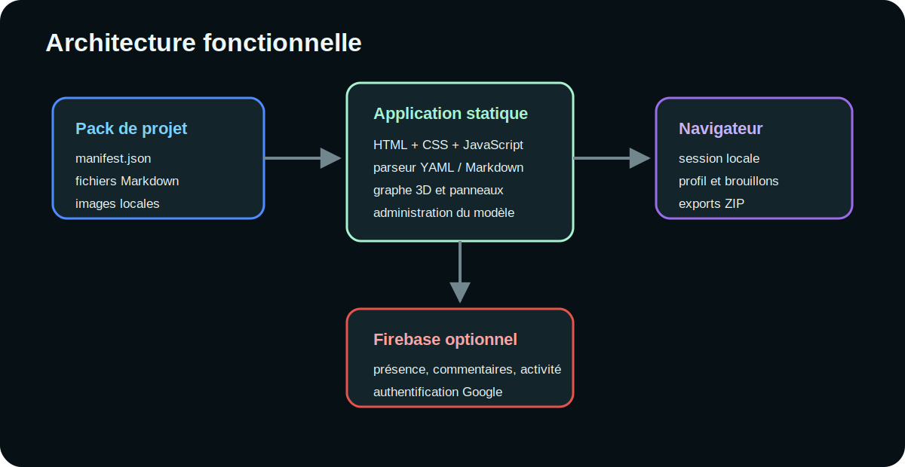

# Architecture de l’application



## Vue d’ensemble

PROSPECTRE est une application statique exécutée dans le navigateur. Le corpus
est chargé depuis un pack, transformé en entités, puis projeté sous forme de
graphe.

```text
manifest.json
    ↓
fichiers Markdown + assets
    ↓
parsing YAML / Markdown
    ↓
normalisation des entités
    ↓
nœuds + relations
    ↓
graphe 3D + panneaux + analyses
```

## Composants principaux

| Composant | Responsabilité |
|---|---|
| `index.html` | structure des panneaux et chargement des bibliothèques |
| `assets/css/app.css` | thèmes, responsive, panneaux et rendu Markdown |
| `assets/js/main.js` | bootstrap, état de session et composition des contrôleurs de vue |
| `assets/js/core/` | configuration générique, profil et utilitaires |
| `assets/js/model/` | schéma, parsing des entités et construction générique des relations |
| `assets/js/graph/` | objets Three.js, textures et labels des nœuds |
| `assets/js/services/` | fournisseurs de collaboration locale et Firebase |
| `assets/js/ui/` | rendu Markdown et composants d’interface spécialisés |
| `app.config.js` | nom, Firebase et liste des administrateurs |
| `data/*/manifest.json` | projet canonique et schéma |
| `firebase.database.rules.json` | contrôle serveur des données sociales |

## Bibliothèques

- **3d-force-graph / Three.js** : graphe spatial ;
- **js-yaml** : lecture et écriture du front matter ;
- **marked** : conversion Markdown vers HTML ;
- **DOMPurify** : assainissement du HTML ;
- **JSZip** : lecture et génération des archives ;
- **Chart.js** : visualisations analytiques ;
- **Firebase** : présence, activité, commentaires et authentification.

## État local

L’état applicatif conserve fichiers, entités, graphe, sélection, filtres,
profil, commentaires, activité et schéma. Les données persistantes sont
enregistrées dans `localStorage`.

## Frontières de confiance

1. Le pack importé est non fiable : YAML et Markdown sont analysés.
2. Le HTML généré est assaini par DOMPurify.
3. Firebase ne reçoit pas les contenus Markdown.
4. Les règles Firebase restent la barrière d’autorisation distante.

## Extension

Une évolution doit privilégier :

- le schéma et les métadonnées plutôt que des conditions codées en dur ;
- les fonctions de normalisation plutôt que la mutation dispersée ;
- l’ajout d’un module dans le domaine propriétaire plutôt que l’extension du bootstrap ;
- des exports conformes à `format_version` ;
- des tests sur un pack minimal et un pack dense.

## Modèle générique

Le moteur ne déclare aucun vocabulaire métier SNT. Le fallback de
`core/config.js` contient un unique type générique `item`, utilisé seulement
quand un pack ne fournit pas de propriété `modele`.

Les packs pilotent les filtres, couleurs, libellés, champs, références et
relations depuis leur manifeste. Le pack SNT livré a été migré vers ce contrat ;
le moteur ne contient donc plus d’adaptateur métier ou de couche de
rétrocompatibilité.
